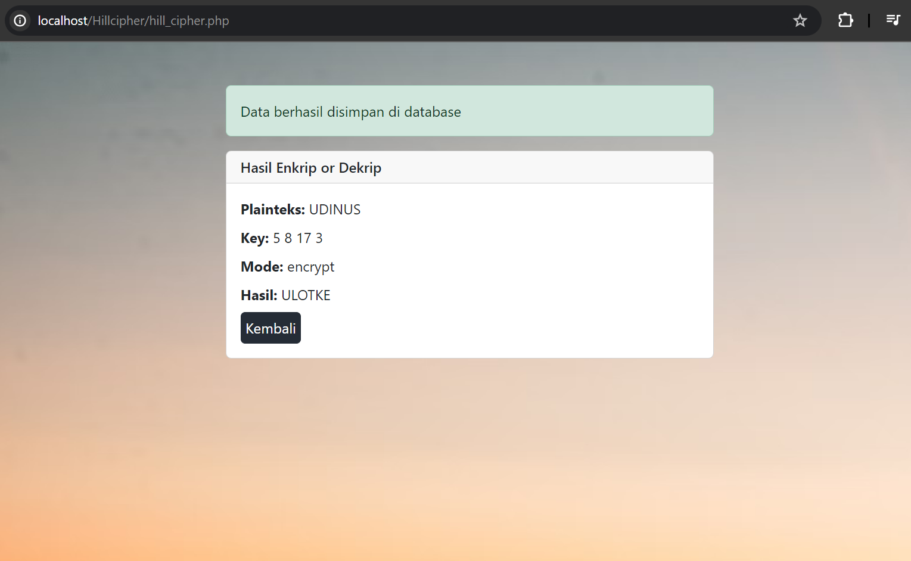

# Kriptografi
# Hill Cipher
## Enkripsi-Dekripsi
<body>
    <table border="1">
        <tr>
            <th> Nama</th>
            <th>NIM</th>
            <th>Kelas</th>
        </tr>
        <tr>
            <td>Billy Alfauzi Caesar</td>
            <td>312110152</td>
            <td>TI.21.A.1</td>
        </tr>
    </table>
</body>

## Enkripsi

Pengguna mengakses halaman index.php yang menampilkan formulir untuk memasukkan teks plainteks, matriks kunci (2x2), dan memilih mode enkripsi atau dekripsi (dengan mode diatur dalam radio button).

- Setelah pengguna mengisi formulir dan mengirimkannya, data yang dimasukkan diambil dengan metode POST di halaman hill_cipher.php. Halaman hill_cipher.php menginisialisasi koneksi ke database MySQL.

- Informasi koneksi seperti nama host, nama pengguna, kata sandi, dan nama database didefinisikan di halaman ini.

## Dekripsi

Mengonversi ciphertext kembali ke teks awal

Proses Dekripsi Text berhasil

## Hasil Data

Hasil enkripsi atau dekripsi bersama dengan text, kunci, dan mode disimpan ke dalam database MySQL menggunakan perintah SQL. Hasil ini akan digunakan untuk ditampilkan di halaman data.php dan dapat diakses kembali.

Hasil enkripsi atau dekripsi disimpan dalam variabel result.

## Done

# Panjang Umur Untuk Semua Hal-Hal Baik
